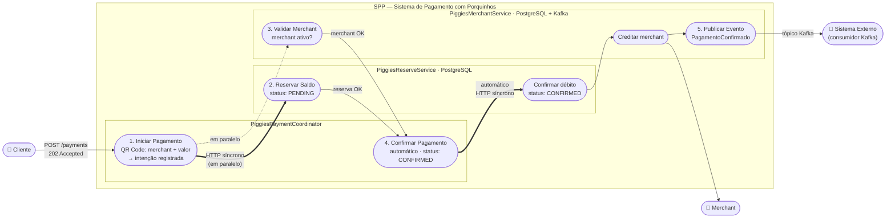
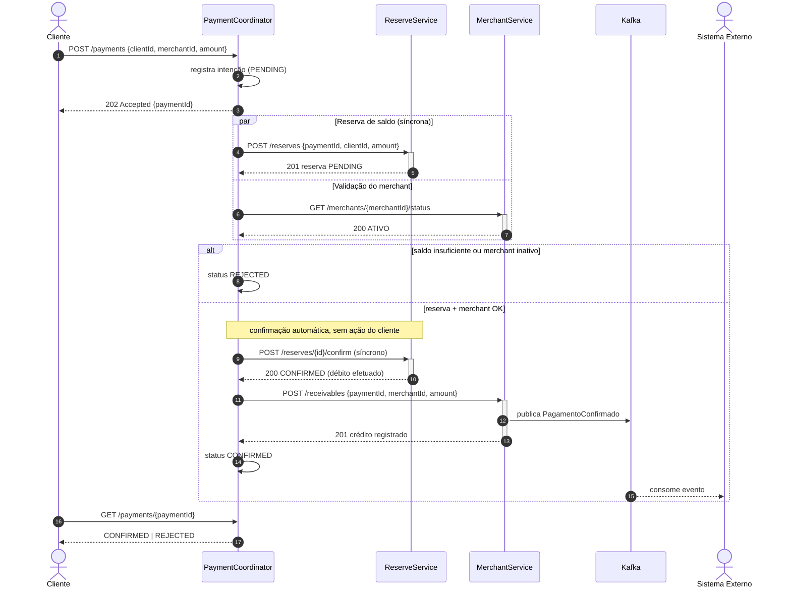

## Instructions

No Inter trabalhamos com `contract-first`. O primeiro passo de qualquer entrega é
definir os contratos entre os microserviços usando OpenAPI ou JSON Schema — um contrato
por serviço, definido antes da implementação. Eventos publicados (ex.: Kafka) também
devem ter schema.

Os clientes do Inter não gostam de ficar olhando para uma ampulheta na tela, por
isso todo serviço de borda precisa trabalhar de forma assíncrona.

Testes unitários e de integração são obrigatórios.

Planejem as entregas. Tempo é um recurso limitado e a gestão do tempo é parte do desafio.

Trabalhem em equipe. Vocês não estão competindo entre si. Vocês vencem juntos ou perdem juntos.

Uma entrega parcial que faz alguma coisa vale mais do que um monte de código que não
realiza nada.

Vocês podem usar IA, consultar a internet e usar qualquer outra ferramenta à sua
disposição, desde que tudo seja anexado ao projeto e comitado (pesquisas, prompts,
códigos de referência, etc.).

Contudo, usem com responsabilidade:
- Vocês precisarão resolver bugs e responder questões sobre a implementação. Responder
  "Não sei, a IA que fez assim" é critério de eliminação.
- Fiquem atentos quanto a propriedade intelectual e nunca utilizem códigos ou documentos
  que vocês não estão autorizados a publicar.

Boa sorte. Vocês têm 1h30 para concluir o desafio.


## SPP — Sistema de Pagamento com Porquinhos

Piggie é a nova stablecoin do Inter. O desafio é implementar o Sistema de Pagamento com Porquinhos (SPP).

Um pagamento envolve algumas etapas:

1. Cliente inicia um pagamento por meio de um QR Code que identifica o merchant e a quantidade de Piggies
2. Em paralelo, a intenção de pagamento é registrada, o saldo do cliente é reservado e o merchant é validado
3. Quando as três operações concluem com sucesso, o pagamento é confirmado: Piggies são debitados do cliente, creditados ao merchant e o evento é publicado para outros sistemas

Exemplo:
- Cliente A inicia pagamento de 100 Piggies ao Merchant X
- Intenção de pagamento é registrada
- Reserva de 100 Piggies é criada na conta do Cliente A
- Merchant X é validado como ativo
- Pagamento é confirmado: 100 Piggies debitados de A, 100 creditados a X

**IMPORTANTE** nessa dinâmica vamos implementar uma versão simplificada do sistema:
- Pagamentos são sempre por um valor inteiro de Piggies
- Não há cancelamento após confirmação

Vocês devem implementar 3 serviços:

- **PiggiesPaymentCoordinator** é o ponto de entrada do App, registra a intenção de pagamento e orquestra a confirmação de ponta a ponta.
- **PiggiesReserveService** reserva e confirma o débito do cliente. Persiste o estado da reserva em PostgreSQL.
- **PiggiesMerchantService** valida o merchant e registra o crédito. Persiste recebíveis em PostgreSQL e consome/publica eventos de pagamento via Kafka.


## Diagramas
> O cliente recebe `202 Accepted` na hora (borda assíncrona). Internamente, o Coordinator
> chama o ReserveService de forma **síncrona** (HTTP, aguardando a resposta) e, quando
> reserva + merchant estão OK, **confirma o débito automaticamente**, sem nenhuma ação do cliente.

### Caso de uso



### Sequência




## Estrutura e como rodar

```
contracts/          OpenAPI de cada serviço + JSON Schema do evento Kafka (contract-first)
coordinator/        PiggiesPaymentCoordinator  (porta 8080)
reserve/            PiggiesReserveService      (porta 8081)
merchant/           PiggiesMerchantService     (porta 8082)
testing-support/    bases de teste (Testcontainers) e validação de contratos
docker-compose.yml  Postgres (3 bancos) + Kafka para rodar à mão
docs/               diagramas, vault do Obsidian (docs/obsidian-vault) e registros de IA (docs/ai)
```

```bash
docker compose up -d                       # Postgres :5432 e Kafka :9092
./mvnw -pl coordinator -am mn:run          # idem para reserve / merchant (em terminais separados)
./mvnw test                                # unitários + integração (integração requer Docker)
./mvnw test -Dtest='!*ApplicationTest'     # só o que não precisa de Docker
```

Teste ponta a ponta (com `docker compose up -d` e os três serviços rodando): `./scripts/e2e.sh`
— cobre caminho feliz, saldo insuficiente, merchant inativo (com liberação da reserva), merchant inexistente,
idempotência e validação do body.
