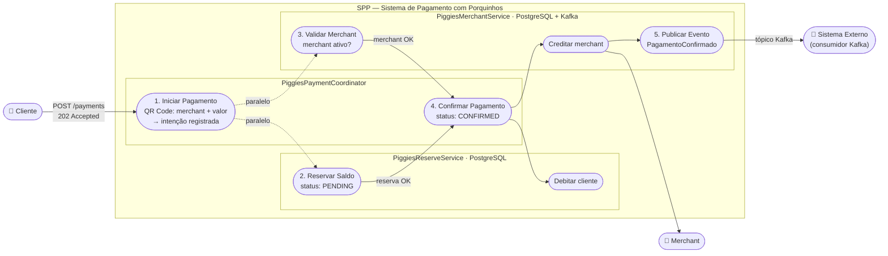
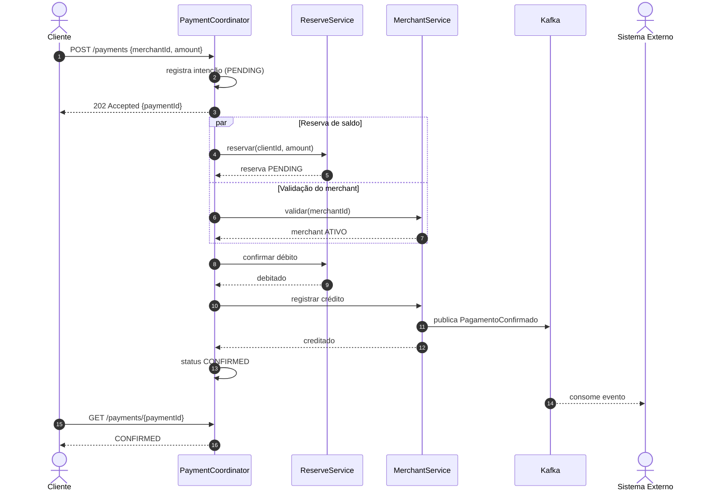

# Diagramas — SPP (Sistema de Pagamento com Porquinhos)

## Caso de uso

```mermaid
flowchart LR
    Cliente(["👤 Cliente"])
    Merchant(["🏪 Merchant"])
    Externo(["📡 Sistema Externo<br/>(consumidor Kafka)"])

    subgraph SPP["SPP — Sistema de Pagamento com Porquinhos"]
        direction TB

        subgraph COORD["PiggiesPaymentCoordinator"]
            UC1(["1. Iniciar Pagamento<br/>QR Code: merchant + valor<br/>→ intenção registrada"])
            UC4(["4. Confirmar Pagamento<br/>status: CONFIRMED"])
        end

        subgraph RES["PiggiesReserveService · PostgreSQL"]
            UC2(["2. Reservar Saldo<br/>status: PENDING"])
            DEB(["Debitar cliente"])
        end

        subgraph MER["PiggiesMerchantService · PostgreSQL + Kafka"]
            UC3(["3. Validar Merchant<br/>merchant ativo?"])
            CRE(["Creditar merchant"])
            UC5(["5. Publicar Evento<br/>PagamentoConfirmado"])
        end
    end

    Cliente -->|"POST /payments<br/>202 Accepted"| UC1
    UC1 -.->|paralelo| UC2
    UC1 -.->|paralelo| UC3
    UC2 -->|reserva OK| UC4
    UC3 -->|merchant OK| UC4
    UC4 --> DEB
    UC4 --> CRE
    CRE --> UC5
    CRE --> Merchant
    UC5 -->|tópico Kafka| Externo
```

## Sequência (fluxo assíncrono)

```mermaid
sequenceDiagram
    autonumber
    actor C as Cliente
    participant PC as PaymentCoordinator
    participant RS as ReserveService
    participant MS as MerchantService
    participant K as Kafka
    actor EX as Sistema Externo

    C->>PC: POST /payments {merchantId, amount}
    PC->>PC: registra intenção (PENDING)
    PC-->>C: 202 Accepted {paymentId}

    par Reserva de saldo
        PC->>RS: reservar(clientId, amount)
        RS-->>PC: reserva PENDING
    and Validação do merchant
        PC->>MS: validar(merchantId)
        MS-->>PC: merchant ATIVO
    end

    PC->>RS: confirmar débito
    RS-->>PC: debitado
    PC->>MS: registrar crédito
    MS->>K: publica PagamentoConfirmado
    MS-->>PC: creditado
    PC->>PC: status CONFIRMED
    K-->>EX: consome evento

    C->>PC: GET /payments/{paymentId}
    PC-->>C: CONFIRMED
```
