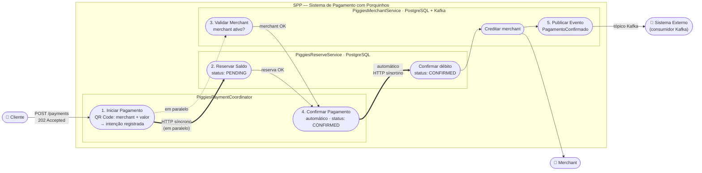
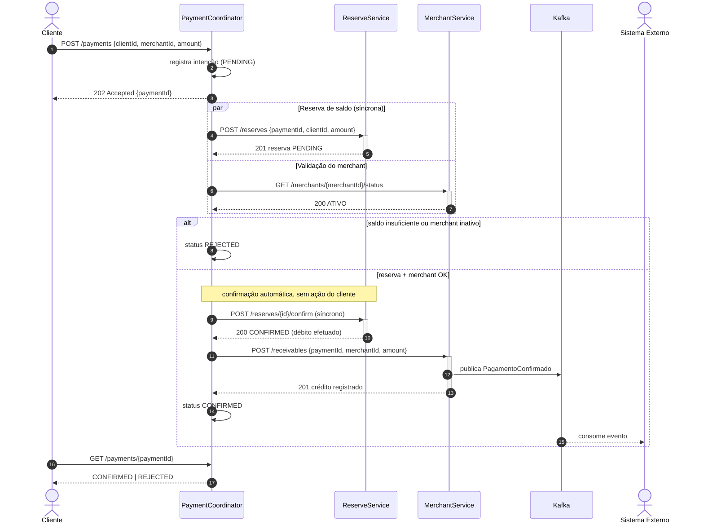

# Diagramas — SPP (Sistema de Pagamento com Porquinhos)

> O cliente recebe `202 Accepted` na hora (borda assíncrona). Internamente, o Coordinator
> chama o ReserveService de forma **síncrona** (HTTP, aguardando a resposta) e, quando
> reserva + merchant estão OK, **confirma o débito automaticamente**, sem nenhuma ação do cliente.

## Caso de uso

## Sequência

