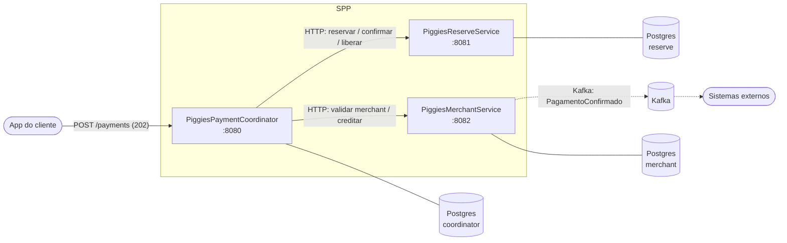
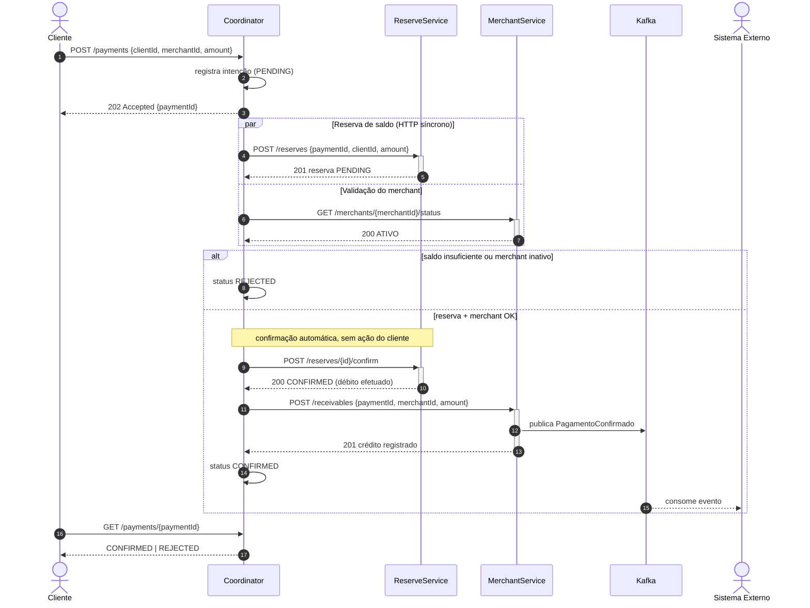
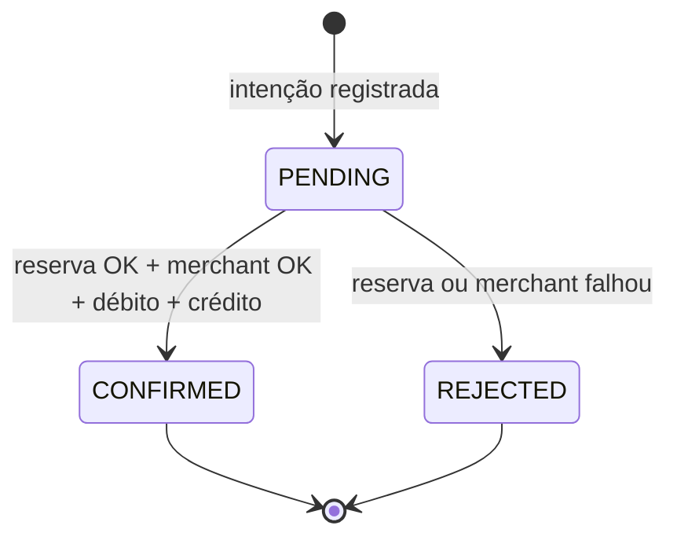

# 02 — Arquitetura e Fluxo

Voltar: [[00 - Índice]] · Próximo: [[03 - Contratos (Contract-First)]]

> [!info] Fonte da verdade visual
> Os diagramas oficiais da equipe estão em `docs/diagramas.md` (caso de uso + sequência). Esta nota os explica e acrescenta falhas, estados e dados.

## Visão de componentes

> [!tip] Um Postgres, três bancos/schemas
> Cada serviço é dono dos seus dados e nunca lê tabela de outro. Em dev/teste pode ser **uma instância** com bancos lógicos separados.

## Sequência do caminho feliz

### Leitura passo a passo
1. **Intenção síncrona**: o Coordinator grava `PENDING` *antes* de responder `202`. Assim o `GET /payments/{id}` nunca dá 404 por corrida.
   - **Borda assíncrona, interior síncrono**: o cliente recebe `202` na hora; entre os serviços as chamadas HTTP aguardam a resposta (como no `docs/diagramas.md`).
2. **Paralelismo**: reserva e validação do merchant rodam juntas (`CompletableFuture.allOf` ou virtual threads).
3. **Decisão**: só com as duas OK o Coordinator confirma. Confirmação = debitar no Reserve → creditar no Merchant.
4. **Evento**: o *Merchant* publica `PagamentoConfirmado` depois de gravar o recebível, então o evento só existe se o crédito existe.
5. **Status final**: `CONFIRMED` só depois de "creditado"; recusas viram `REJECTED`.
6. **Confirmação automática**: nenhuma ação do cliente depois do QR Code.

## Caminhos de falha
| Falha | Reação do Coordinator |
|-------|----------------------|
| Saldo insuficiente | `REJECTED (INSUFFICIENT_FUNDS)`; nada a liberar |
| Merchant inexistente/inativo | `REJECTED (MERCHANT_INVALID)`; **libera a reserva** |
| Reserve ou Merchant indisponível / timeout | `REJECTED (UNAVAILABLE/TIMEOUT)`; libera reserva (best effort) |
| Falha ao confirmar débito | Reserva continua `PENDING`; retry; expiração libera |
| Falha ao creditar **após** débito confirmado | Retry idempotente do crédito (não há estorno pós-débito) — ver [[09 - Decisões e Riscos]] |
| Crédito repetido (retry) | Merchant responde 200 com o mesmo recebível (UNIQUE `payment_id`) |

## Máquina de estados do pagamento (Coordinator)

> O nome do estado de recusa segue o diagrama oficial: **`REJECTED`** (não `FAILED`).

Estado da **reserva** (Reserve): `PENDING → CONFIRMED` ou `PENDING → RELEASED`.

## Onde cada dado mora
| Dado | Serviço | Tabela |
|------|---------|--------|
| Intenção/status do pagamento | Coordinator | `payment` |
| Saldo e reservas | Reserve | `account`, `reservation` |
| Merchants e recebíveis | Merchant | `merchant`, `receivable` |

Detalhes em [[04 - PiggiesPaymentCoordinator]], [[05 - PiggiesReserveService]] e [[06 - PiggiesMerchantService]].
