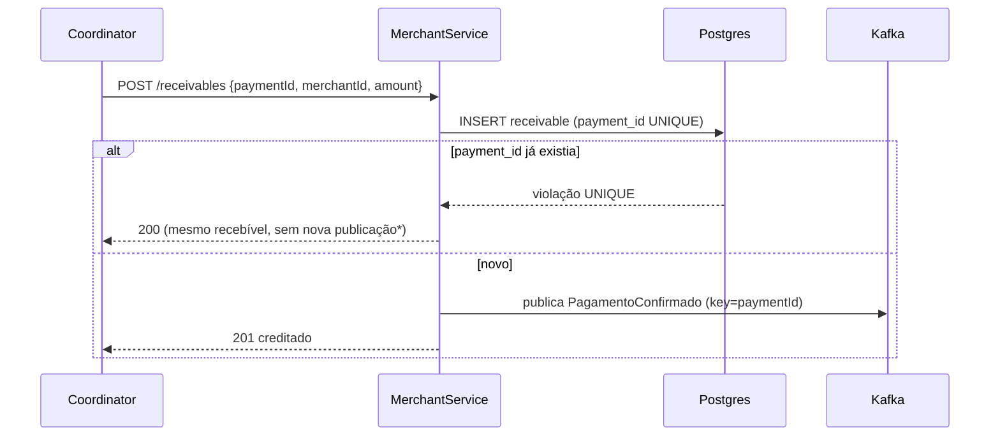

# 06 — PiggiesMerchantService

Voltar: [[00 - Índice]] · Fluxo: [[02 - Arquitetura e Fluxo]]

## Responsabilidade
1. **Validar** se o merchant existe e está ativo (síncrono, HTTP).
2. **Registrar o crédito** (recebível), chamado pelo Coordinator após o débito.
3. **Publicar** `PagamentoConfirmado` no Kafka para sistemas externos.

## Modelo de dados
**`merchant`**: `id` (varchar PK), `name`, `status` (`ACTIVE`/`INACTIVE`).

**`receivable`**
| Coluna | Tipo | Nota |
|--------|------|------|
| `id` | uuid PK | |
| `payment_id` | uuid **UNIQUE** | idempotência do crédito |
| `merchant_id` | varchar FK | |
| `amount` | bigint | |
| `created_at` | timestamptz | |

## Fluxo do crédito


\* Se o primeiro crédito gravou mas não conseguiu publicar, o retry precisa republicar. Solução simples: guardar `event_published boolean` no recebível e publicar no retry enquanto for `false`. O *Outbox* completo é stretch — ver [[09 - Decisões e Riscos]].

## Garantias e armadilhas
- O Coordinator pode repetir o crédito (retry) → **idempotência por `payment_id`**.
- Publicar **depois** do commit do recebível; o evento nunca existe sem o crédito.
- `@KafkaClient` com `acks=all`; chave = `paymentId`.
- Só publicar eventos que **validam no JSON Schema** de [[03 - Contratos (Contract-First)]].
- Crédito para merchant inativo → `409` (defesa extra; a validação já ocorreu antes).

> [!question] E o "consome" do enunciado?
> O enunciado diz que o Merchant "consome/publica eventos via Kafka", mas o diagrama da equipe só mostra a publicação. Se a banca esperar um consumidor, a evolução natural é o Coordinator publicar um evento de débito confirmado e o Merchant consumi-lo em vez do `POST /receivables` — o recebível idempotente já suporta isso. Registrado em [[09 - Decisões e Riscos]].

## Validação de merchant
`GET /merchants/{merchantId}/status` → `{merchantId, active}`; `404` se não existir (Coordinator trata como `MERCHANT_INVALID`). Seed de teste: `X` ativo, `Y` inativo.

## Estrutura de pacotes sugerida
```
co.inter.piggies.merchant
├── api        (MerchantController)
├── domain     (Merchant, Receivable)
├── service    (ReceivableService)
├── messaging  (PagamentoConfirmadoPublisher)
└── repository
```

## Testes
- Unit: `ReceivableService` (cria; duplicata idempotente; merchant inexistente/inativo).
- Integração: `POST /receivables` → recebível no Postgres → consumir o tópico no Kafka Testcontainer e validar contra o schema. Mesmo `paymentId` 2x → 1 recebível. Ver [[07 - Estratégia de Testes]].
