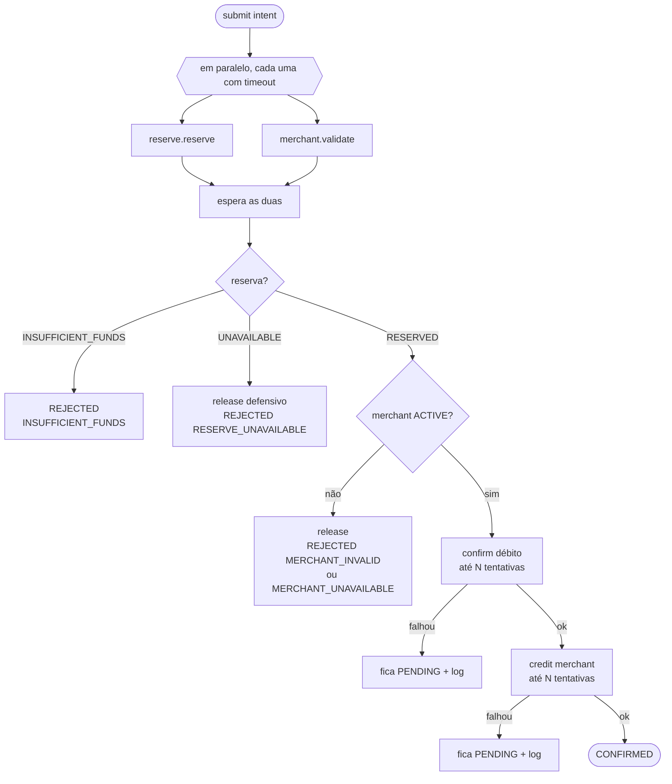

# 11 — Implementação do Dev 4 (plataforma, contratos e orquestração)

Voltar: [[00 - Índice]] · Plano: [[10 - Divisão da Equipe (4 devs)]]

> [!success] Estado
> Fases A, B e C do Dev 4 **concluídas** (a C é o `scripts/e2e.sh`, ainda não executado — ver [[12 - Implementação Devs 1, 2 e 3]]). Os serviços dos Devs 1–3 também já estão implementados.

## 1. O que foi entregue

### Estrutura multi-módulo (Maven)
```
pom.xml                  pai (spp): deps comuns, annotation processors, Java 25
├── testing-support/     bases de teste + validação de contratos (só test)
├── coordinator/         :8080  CoordinatorApplication
├── reserve/             :8081  ReserveApplication
└── merchant/            :8082  MerchantApplication
contracts/               OpenAPI ×3 + events/pagamento-confirmado.v1.schema.json
docker-compose.yml       Postgres (3 bancos) + Kafka
docs/ai/                 registro de uso de IA (exigência do README)
```
- O projeto único do scaffold (`test_jackson`, `Piggy`, `Test_jacksonTest`) foi removido.
- **Java 25 mantido** (decisão do time, [[09 - Decisões e Riscos]]). `micronaut-kafka` só no `merchant`; `micronaut-http-client` em compile só no `coordinator`.
- Cada módulo tem `application.yml` próprio (porta, banco, variáveis de ambiente com default), `logback.xml` e um **smoke test** que sobe a app.

### Contratos ([[03 - Contratos (Contract-First)]])
Escritos em `contracts/` e alinhados ao `docs/diagramas.md`: rotas `/payments`, `/reserves`, `/merchants/{id}/status`, `/receivables` e o evento `PagamentoConfirmado` (tópico `piggies.pagamento-confirmado.v1`).

### Infra local
`docker compose up -d` sobe Postgres (bancos `coordinator`, `reserve`, `merchant`, criados por `docker/postgres-init/01-databases.sql`) e Kafka em `localhost:9092`. Senha do Postgres: `postgres`.

### testing-support
| Classe | Uso |
|--------|-----|
| `AbstractPostgresIntegrationTest` | Teste de integração com Postgres Testcontainer (Reserve e Coordinator) |
| `AbstractPostgresKafkaIntegrationTest` | Idem + Kafka (Merchant) |
| `ContractSchemas.assertValid(arquivo, json)` | Valida um payload contra `contracts/events/*.json` (Dev 3 usa no teste do evento) |

## 2. Orquestrador do Coordinator

### Pacotes (`co.inter.piggies.coordinator`)
| Pacote | Conteúdo | Dono |
|--------|----------|------|
| `domain` | `PaymentIntent`, `RejectionReason` | Dev 4 (usados por todos) |
| `port` | `PaymentOrchestrator`, `PaymentStatusUpdater`, `LoggingPaymentStatusUpdater` | Dev 4 |
| `gateway` | `ReserveGateway`, `MerchantGateway` (+ enums de resultado) | Dev 4 |
| `client` | `HttpReserveGateway`, `HttpMerchantGateway` e DTOs | Dev 4 |
| `service` | `DefaultPaymentOrchestrator` | Dev 4 |
| `config` | `OrchestratorProperties` (`spp.orchestrator.*`) | Dev 4 |

### Como o Dev 1 se encaixa
```java
// Dev 1 chama, depois de gravar PENDING e antes de responder 202:
orchestrator.submit(new PaymentIntent(paymentId, clientId, merchantId, amount));

// Dev 1 implementa e grava o resultado na tabela payment:
public interface PaymentStatusUpdater {
    void markConfirmed(UUID paymentId);
    void markRejected(UUID paymentId, RejectionReason reason);
}
```
Hoje há um `LoggingPaymentStatusUpdater` (`@Secondary`) que só loga. **Quando o Dev 1 criar um `@Singleton` que implemente `PaymentStatusUpdater`, ele passa a valer sozinho — nada a remover.** O orquestrador não conhece a entidade JPA `Payment`, só o record `PaymentIntent`: por isso não há dependência de código entre Dev 1 e Dev 4.

### Algoritmo

Regras importantes:
- **Espera as duas etapas terminarem** antes de decidir; assim nunca esquece de liberar uma reserva que ficou "em voo".
- **Timeout vira falha**: estouro ou exceção numa etapa = `UNAVAILABLE` (não derruba o fluxo).
- **Libera defensivamente** quando a reserva está `UNAVAILABLE` (pode ter sido criada e a resposta se perdeu). `release` é idempotente e nunca lança.
- **Nunca rejeita depois de debitar.** Se o débito foi confirmado e o crédito falha, o pagamento fica `PENDING` com `ERROR` no log (o crédito é idempotente, então um reprocessamento é seguro). Isso é o que o enunciado impõe: não há cancelamento pós-confirmação.
- `submit()` **nunca lança**; devolve `CompletableFuture<Void>` só para teste/espera.
- Execução no executor `BLOCKING` do Micronaut; os clients são bloqueantes, mas fora da thread de borda.

### Configuração (`coordinator/src/main/resources/application.yml`)
```yaml
micronaut.http.services.reserve.url:  ${RESERVE_URL:http://localhost:8081}
micronaut.http.services.merchant.url: ${MERCHANT_URL:http://localhost:8082}
spp.orchestrator.timeout: 5s
spp.orchestrator.retry-attempts: 3
```

## 3. Testes entregues
| Teste | Cobre | Docker? |
|-------|-------|---------|
| `DefaultPaymentOrchestratorTest` (13) | caminho feliz, **paralelismo real** (latch), saldo insuficiente, merchant inativo/inexistente/indisponível, reserve indisponível, timeout, exceção de gateway, retry do crédito, débito sem crédito (PENDING), falha de débito, erro ao gravar status | não |
| `HttpGatewaysTest` (9) | corpo enviado conforme o contrato, mapeamento 200/201/404/409/5xx e conexão recusada, usando um servidor HTTP falso | não |
| `ContractSchemasTest` (3) | validação do schema do evento | não |
| `*ApplicationTest` (3, um por módulo) | a aplicação sobe com Postgres (e Kafka no Merchant) | **sim** |

Comando sem Docker: `./mvnw test -Dtest='!*ApplicationTest'` → **25 testes, 0 falhas**.

## 4. Guia de partida para cada dev

> [!tip] Regra de ouro
> Contrato (`contracts/`) é a verdade. Mudou? O Dev 4 atualiza o YAML primeiro.

### Dev 1 — Coordinator (borda)
- Crie `Payment` (entidade), repositório e `PaymentService`; implemente `PaymentStatusUpdater`.
- `POST /payments`: valida → grava `PENDING` → `orchestrator.submit(...)` → `202`. `GET /payments/{id}`.
- Apague `Placeholder.java` ao criar a primeira entidade.

### Dev 2 — Reserve
- Entidades `account`/`reservation` + seed, endpoints de `contracts/reserve.openapi.yaml`.
- Teste de integração: estenda `AbstractPostgresIntegrationTest`. Apague `Placeholder.java`.

### Dev 3 — Merchant
- Entidades `merchant`/`receivable` + seed (`X` ativo, `Y` inativo), `GET status`, `POST /receivables`.
- Publique em `spp.topics.pagamento-confirmado` (já em `application.yml`); teste estendendo `AbstractPostgresKafkaIntegrationTest` e validando com `ContractSchemas.assertValid("pagamento-confirmado.v1.schema.json", json)`. Apague `Placeholder.java`.

### Todos
```bash
docker compose up -d
./mvnw -pl coordinator -am mn:run      # ou reserve / merchant
```
Registrem prompts de IA em `docs/ai/` no mesmo commit do código.

## 5. Pontos de atenção e limitações

> [!warning] `Placeholder.java` em cada módulo
> O Micronaut + Hibernate **não sobe sem nenhuma `@Entity`** ("Entities not found for JPA configuration"). Para que as três apps (e os smoke tests) subam desde o minuto zero, cada módulo tem uma entidade `Placeholder` (tabela `spp_placeholder`). É descartável: **apague quando criar a primeira entidade real**.

> [!warning] Validação feita com JDK 21, não 25
> A máquina onde isso foi construído não tem o JDK 25 do `mise.toml` (só 8, 17 e 21), então a compilação e os testes foram verificados sobrescrevendo `-Djdk.version=21 -Drelease.version=21` na linha de comando; o `pom.xml` continua em 25. O código não usa recursos além do Java 21. **Confirme com `java -version` = 25 na primeira execução** (`mise install`).

> [!warning] Testes com Docker não foram executados
> O Docker não respondeu na máquina de desenvolvimento. Os três `*ApplicationTest` (smoke) e qualquer teste Testcontainers precisam de Docker e **não foram rodados**; o restante foi.

- O `~/.m2/settings.xml` desta máquina usa um Nexus corporativo inacessível; o build foi feito com um `settings.xml` temporário sem mirror (nada alterado no seu).
- Se o `docs/obsidian-vault` for aberto a partir da raiz do repositório, o Obsidian cria `.obsidian/` — considere ignorar no `.gitignore`.

## 6. O que falta (Dev 4, fase C)
- [x] Script e2e (`scripts/e2e.sh`) e instruções no README
- [x] Revisar contratos × implementação (rotas/DTOs cruzados; contrato do Merchant ganhou 409/503)
- [ ] **Executar** o e2e e os testes de integração com Docker
- [ ] (stretch) Job de reprocessamento de pagamentos `PENDING` com débito já confirmado
